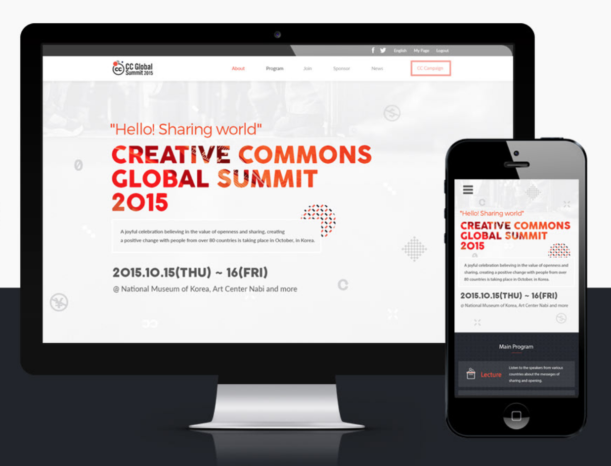

# Capstone1

> This project is a demonstration of the HTML, CSS and JavaScript skills learned during first module weeks at micorverse.
> Its centered around a conference page.

## Project Deployment

- Watch the project live [here](https://onjoseph.github.io/Capstone1/).
- Watch a video about the project [here](https://www.loom.com/share/3c9009956a464f70bf19d54f85012e9c).

## Built With

- HTML
- CSS
- Javascript
- Linters
- Gitflows

## Author

👤 **Joseph Ogbole**

- GitHub: [@ONJoseph](https://github.com/ONJoseph)
- Twitter: [@ONJCodes](https://twitter.com/ONJCodes)
- LinkedIn: [LinkedIn](https://www.linkedin.com/in/o-n-joseph-ba8425147/)

## 🤝 Contributing

Contributions, issues, and feature requests are welcome!

Feel free to check the [issues page](https://github.com/ONJoseph/Capstone1/issues).

## Show your support

Give a ⭐️ if you like this project!

## Acknowledgments

- [Cindy Shin](https://www.behance.net/adagio07) for the original design
- Microverse for the Readme Template

## 📝 License

This project is covered by the [MIT](/LICENSE) license
